# Lab1 - Data understanding

In this second phase of the data science lifecycle, you are going to build a serverless architecture to get an understanding of what data you have and whether you can use this data to train your machine learning model.

You are going to discover the data directly from an Amazon S3 bucket using Amazon Glue to create tables in the Glue Data Catalog, and you are going to understand the data using Amazon Athena for querying and visualization. Finally you will prepare the data so that it can be used to train a machine learning model using Amazon Sagemaker.

* [Creating a bucket and populating it with data](#bucket)
* [Discover the data using AWS Glue Crawler](#discover)
* [Explore the data using Amazon Athena](#explore)

***

### <a name="bucket">Creating a bucket and populating it with data</a>

In the first part of this lab you will use a CloudFormation template to create an S3 bucket and then populate it with some movie rating data and user data.

1. Sign into the AWS Management Console <https://console.aws.amazon.com/>.

2. In the upper-right corner of the AWS Management Console, confirm you are in the desired AWS region (e.g., N. Virginia). **Make sure you select one of the following regions where Amazon Sagemaker is available:** 

   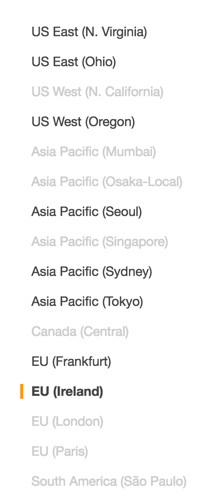

3. Now you will use a CloudFormation template to download MovieLens data from the GroupLens website into the S3 bucket you created. The template uses a CloudFormation custom resource lambda function to download the data and structure the data folders. 


6. <a href="https://console.aws.amazon.com/cloudformation/home#/stacks/create/review?templateURL=https://s3-eu-west-1.amazonaws.com/peerjako-workshops/ml-id/lab1-cloudformation.yaml&stackName=[Your-Initials]-ml-lab1" target="_blank">Use this link</a> to initialize a CloudFormation Create Stack page.

   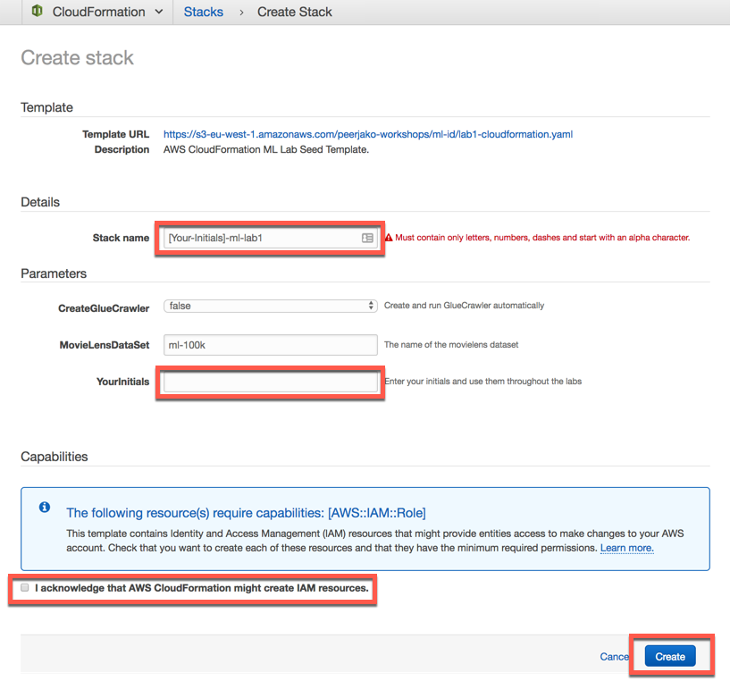

   Edit **[Your-Initials]-ml-lab1** in the **Stack name** text box and enter your initials into the **YourInitials** text box. Remember those initials as you will be using them in later labs.

   Click the **I acknowledge that AWS CloudFormation might create IAM resources** check box. This gives CloudFormation the right to create an IAM role for the Lambda function that will populate your bucket with data.

   Last, click the **Create** button. 

7. Now the CloudFormation Stack is being created. Refresh your browser page until the **Status** changes from **CREATE_IN_PROGRESS** to **CREATE_COMPLETE** (typically takes 1-2 minutes).

   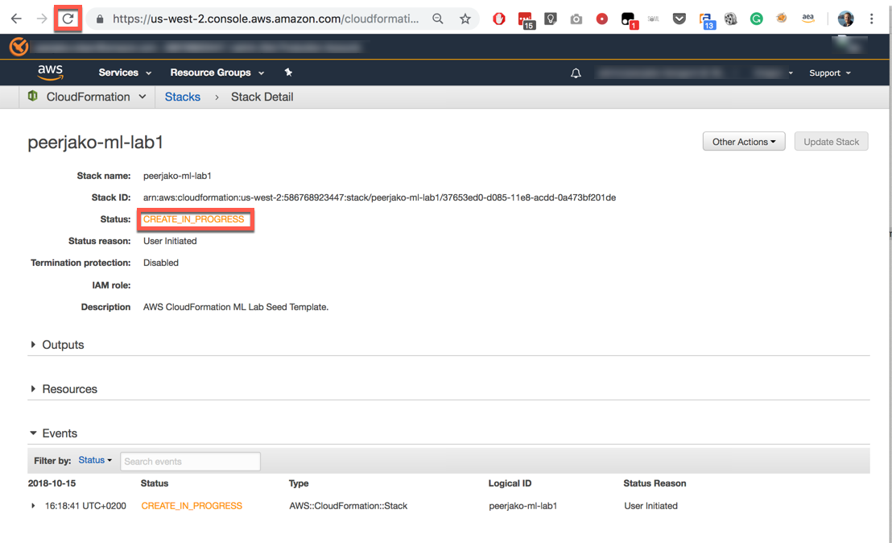

8. Now verify that the S3 bucket created by the CloudFormation stack contains some data by first expanding the **Resources** section and then click on the **bucket name link**.

   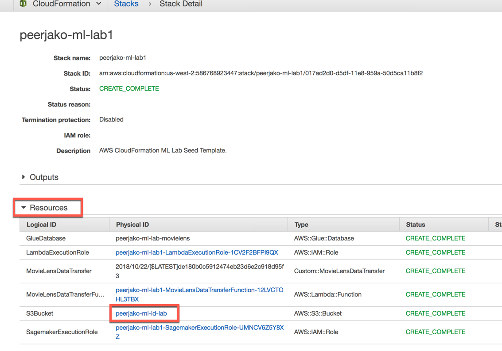


9. If you see a folder called **movie-lens** then the lab data was succesfully copied into your S3 bucket.


  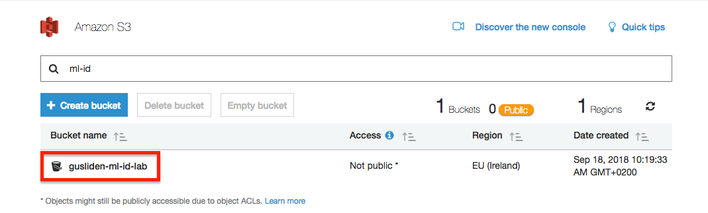

***

<div style="page-break-after: always;"></div>
### <a name="discover">Discover the data using AWS Glue Crawler</a>

In the second part of this lab you will be using AWS Glue to crawl all the data in your S3 bucket and have data tables automatically created in the Glue Data Catalog. This will then later allow you to query the data directly in your S3 bucket using SQL queries.

1. Use [this link](https://console.aws.amazon.com/glue/home) to go into the AWS Glue console. You might see a **Getting started page**. If so, click the **Get Started** button.

2. Now you will add a Glue Crawler that will crawl your S3 bucket for data. On the left side of the screen click on **Crawlers** and then click on the **Add crawler** button.

   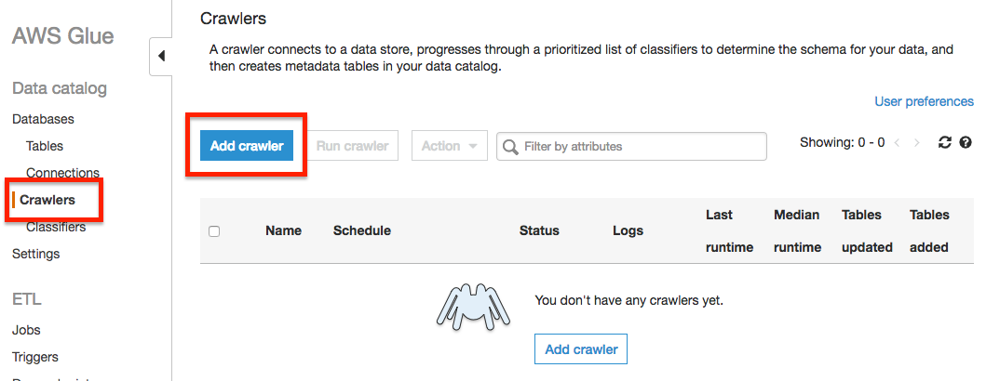

3. Type **[Your-Initials]-ml-id-movielens** into the **Crawler name** text box and then click the **Next** button.

   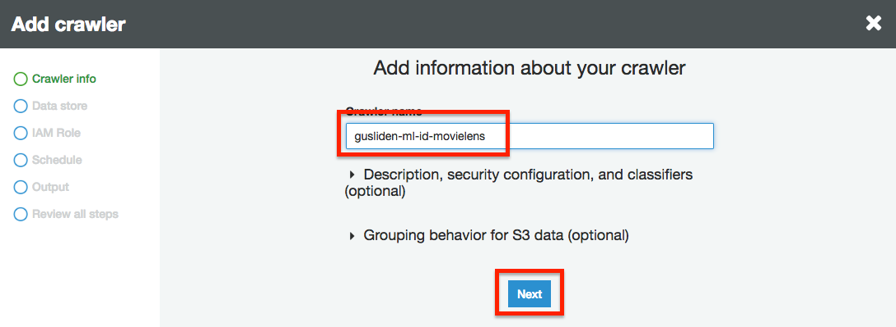

4. We want our data store to be S3 so leave the **Choose a data store** drop down as **S3** and click the **folder icon** next to the **Include path** text box.

   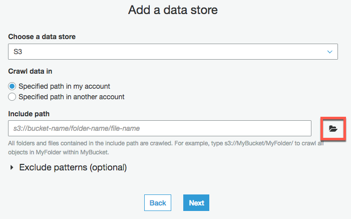

5. Expand the tree selector for the S3 bucket you created earlier and select the **movielens-data** folder. Click the **Select** button.

   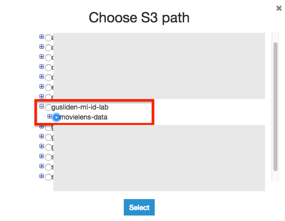

6. Verify that the **Include path** text box has the correct S3 path and then click the **Next** button.

   

7. You will only add one data store to this crawler so just click the **Next** button.

   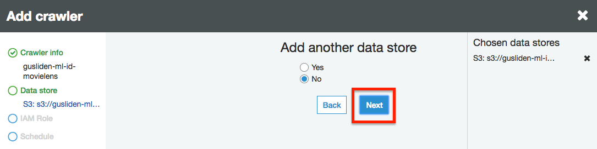

8. The crawler needs to have access to your S3 bucket so you need to create an IAM role that the crawler can assume with access to your S3 bucket. Type **[Your-Initials]-ml-id-lab** into the IAM role text box and then click the **Next** button.

   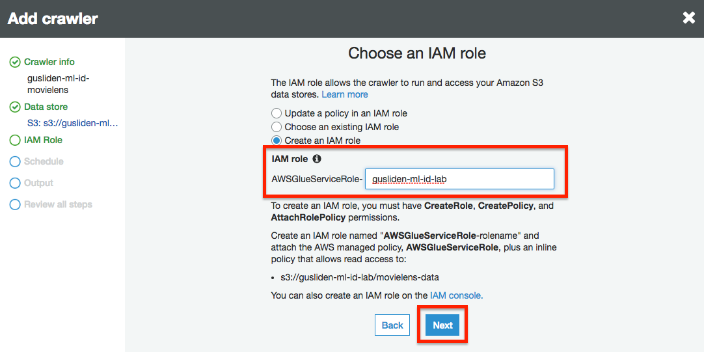

9. You will run the crawler on demand so just leave the **Frequency** drop down list as **Run on demand** and click the **Next** button. If new data was regularly being added to your bucket then creating a scheduler would be a good idea. 

  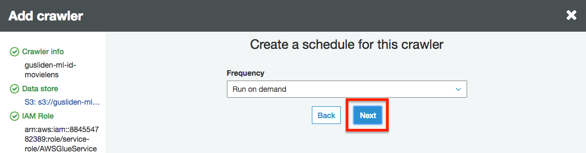

10. The crawler will create data tables in a Glue Metastore database. The CloudFormation stack you created earlier has already created a database that is called something like **[Your-Initials]-ml-lab-movielens**. Select that database and then click the **Next** button.

  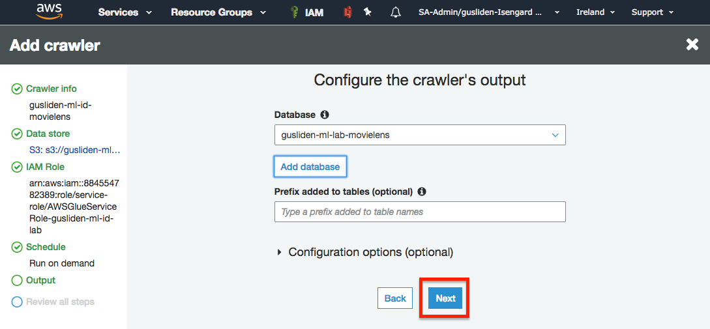

<div style="page-break-after: always;"></div>
13. Verify that your crawler configuration looks correct and then click the **Finish** button.

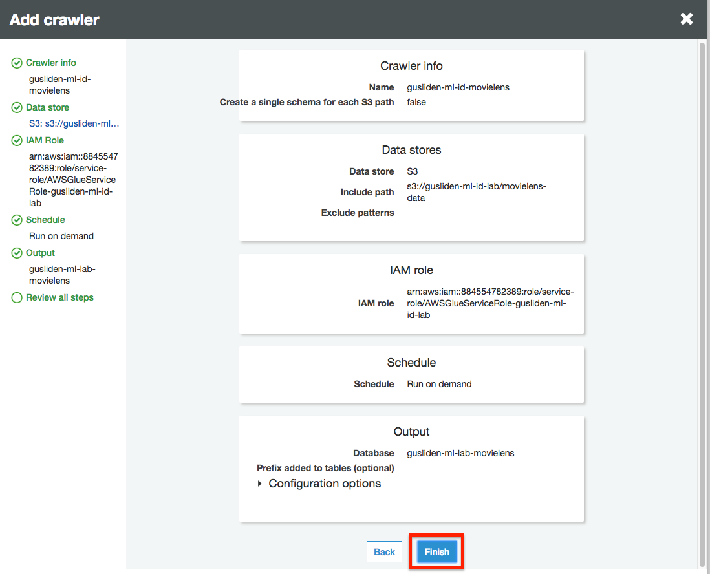

14. Now you want to run the crawler. Select the **Check box** next to your crawler name and then click the **Run crawler** button.

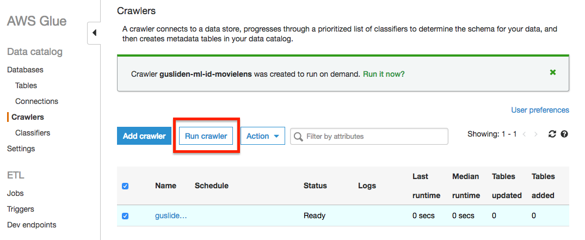

15. The crawler has started running. Wait for the **Status** column to change to **Ready** (typically takes 1-2 minutes) and then click the **Tables** link on the left side of the page.

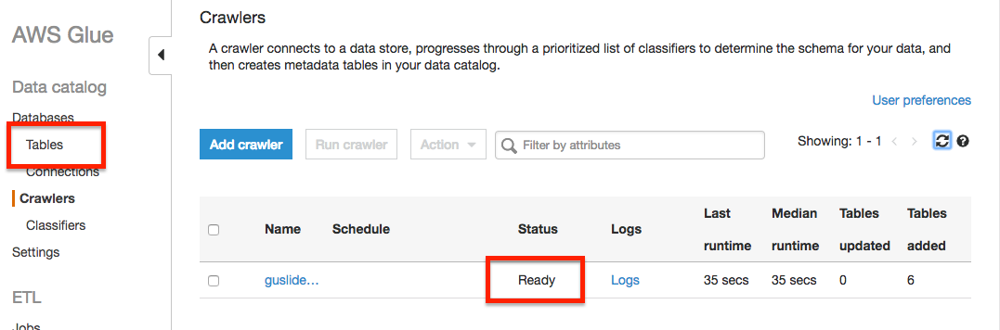

<div style="page-break-after: always;"></div>
16. You can see that the crawler has discovered 6 new tables all prefixed with **u**. If no tables show up then click the refresh button. Now click on the **u_data** table to get details about that table. 


17. Verify that the table look correct by checking the **Schema** in the bottom of the page. You should see 4 columns with the names **userid, movieid, rating, timestamp** all with data type **bigint**.

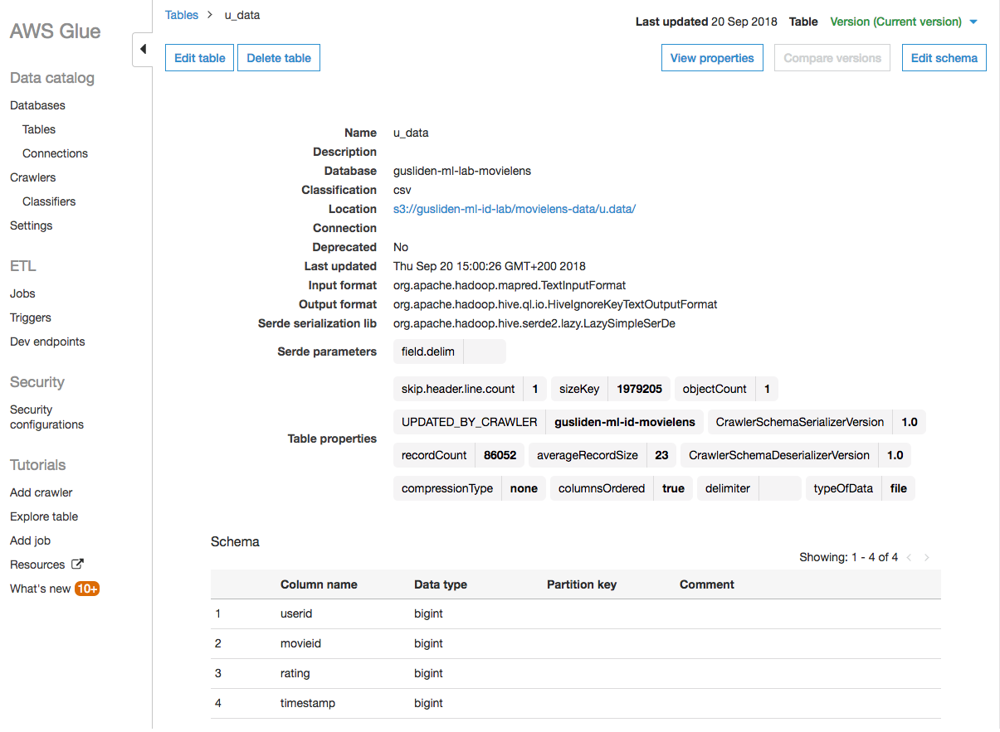

***
<div style="page-break-after: always;"></div>
### <a name="explore">Explore the data using Amazon Athena</a>

In the third and final part of this lab you will be using Amazon Athena to query your data directly in your S3 bucket using SQL queries. This will give you some good insights into what kind of data you have and which type of ML models you can train with the data.

1. Use [this link](https://console.aws.amazon.com/athena/home) to go into the Amazon Athena console. You might see a **Getting started page**. If so, click the **Get Started** button.

2. Athena can query from all the databases that exists in the Glue Metadata store. Click on the **Database** drop down list and select the database you selected during the Glue crawler creation.

   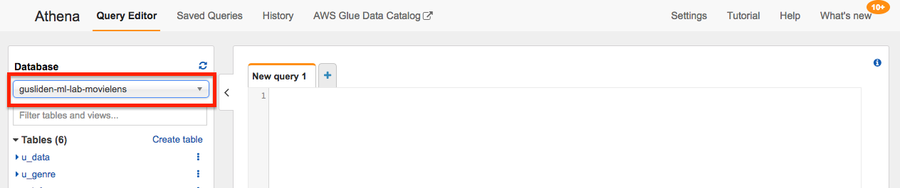

3. To the left you can see the list of tables that your Glue crawler created in your database. Click the **3 dots** next to the **u_data** table and select **Preview table**.

   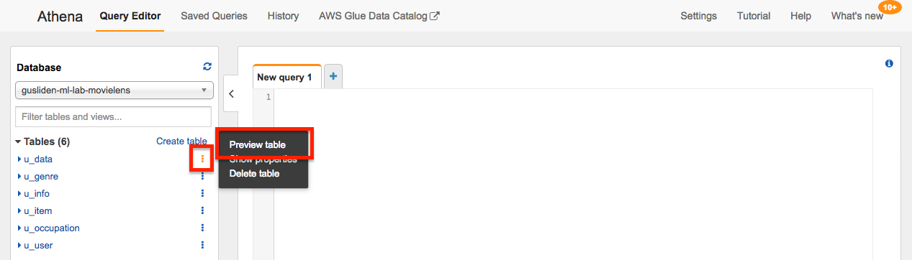

4. A `select *` query was automatically created and executed against the **u_data** table. In the **result pane** you can see that the table has rows with a userid, a movieid of a rated movie, the rating of the movie by the user and the timestamp of when the rating was created. The timestamps are in epoch format.

   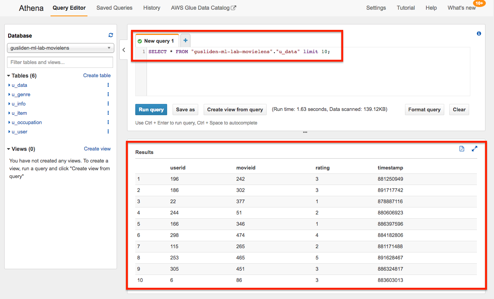

5. Explore the u_data table further by entering the following query into the **query** text box:

   ```sql
   SELECT count(*) rowCount,
            count(distinct userid) AS userCnt,
            count(distinct movieid) AS movieCnt,
            min(rating) AS minRating,
            max(rating) AS maxRating
   FROM "u_data"
   ```

    Click the **Run query** button.  The result shows that u_data has 100.000 rows, 943 distinct users and 1682 distinct movies and the ratings goes from 1 to 5.

   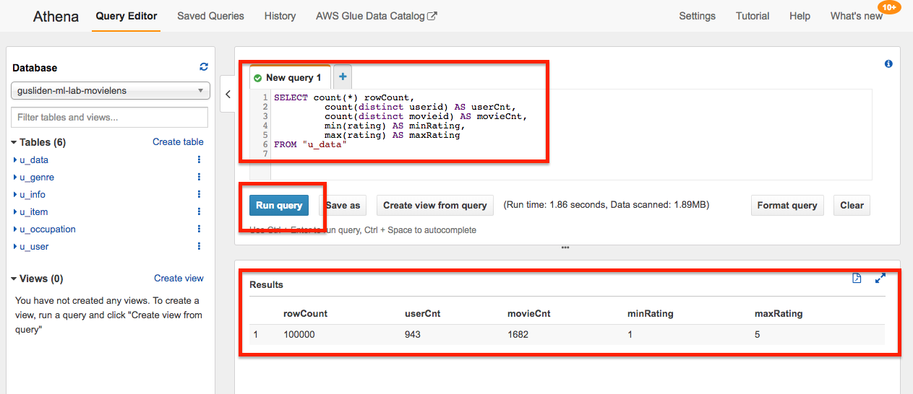
<div style="page-break-after: always;"></div>
6. Explore the u_data table even further. Click the **+** sign next to the **New query 1** tab and enter the following query into the **New query 2** text box:

   ```sql
   SELECT min(ratingsPerUser) minRatingsPerUser,
            max(ratingsPerUser) maxRatingsPerUser
   FROM 
       (SELECT userid,
            count(*) ratingsPerUser
       FROM "u_data"
       GROUP BY  userid )
   ```

   Click the **Run query** button.  The result shows that every user has rated a minimum of 20 movies and a maximum of 737 movies.

   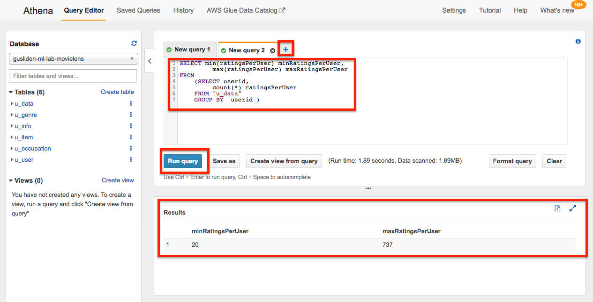

7. Create a new query (using the **+** sign), and explore the **u_user** table by clicking the **3 dots** next to the **u_user table** and select **Preview table**.

   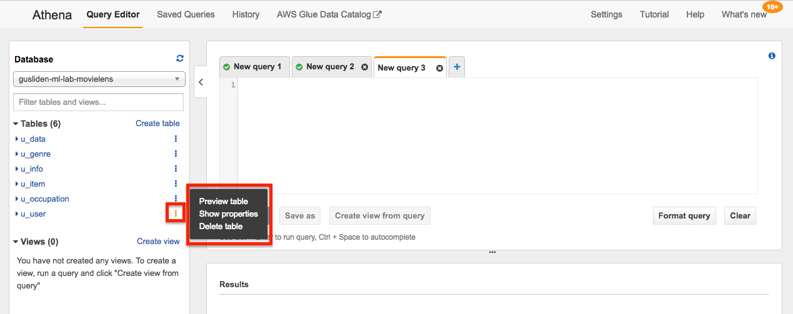
<div style="page-break-after: always;"></div>
8. In the **result pane** you can see that the table has rows with a userid, age, gender and occupation of the user and a zip code for the users address.

   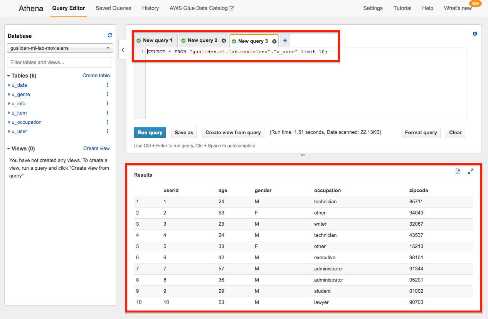

9. Join the **u_data** and **u_user** tables by entering the following query into a new **query** text box:

   ```sql
   SELECT * FROM "u_data" ratings
   INNER JOIN "u_user" user on ratings.userid = user.userid
   limit 10;
   ```

   Click the **Run query** button and notice how Athena can query and join data directly from **S3**.

   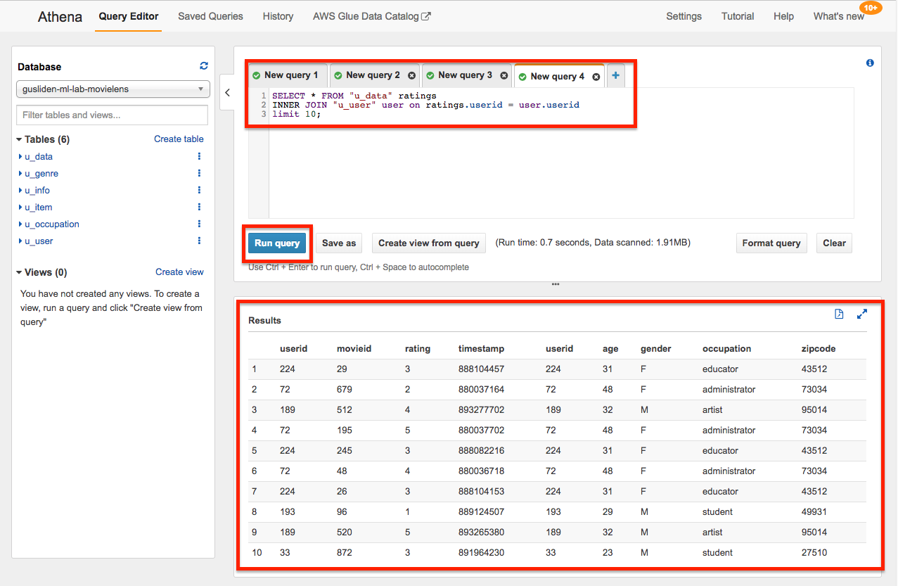

#### Congratulations! You have successfully completed Lab 1.

You have learned several interesting facts about the data available and have a good understanding of the data. In Lab 2 you will use that information to select your first machine learning algorithm for the business case.